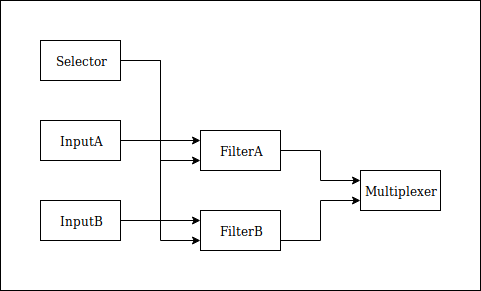

An example implementation of relays.

```js
const Relay = require('../../index.js');

/**
 * Create a processor callback that filters input if it is a byte number
 */
const InputProcessor = x => typeof x === 'number' && 0 <= x && x <= 255 && x;

/**
 * Create two inputs with InputProcessor
 */
const InputA = new Relay(InputProcessor);
const InputB = new Relay(InputProcessor);

/**
 * Create a selector that tells the multiplexer which
 * input shall be selected.
 */
const Selector = new Relay(x => typeof x === 'boolean' && x);

/**
 * create a filter that checks one of the inputs if it is a string,
 * assume that it was received from the Selector, and a number received
 * from the Input. 
 */
const BasicFilter = (a, b, key) => typeof a === 'boolean' && typeof b === 'number' && a === key && b;

/**
 * Create a processor for the multiplexer filter, assume that one of the arguments
 * are a string and a number.
 */
const FilterInputProcessor = (a, b, key) => BasicFilter(a, b, key) || BasicFilter(b, a, key);

/**
 * Create the Filter Relay
 */
const FilterA = new Relay((a, b) => FilterInputProcessor(a, b, true));
const FilterB = new Relay((a, b) => FilterInputProcessor(a, b, false));

/**
 * Connect inputs to filters
 */
InputA.connectTo(FilterA);
InputB.connectTo(FilterB);

/**
 * Connect selector to filters
 */
Selector.connectTo(FilterA);
Selector.connectTo(FilterB);

/**
 * Create the multiplexer processor
 */
const Multiplexer = x => x && console.log('Input selected:', x);
/**
 * Connect from Filters
 */
FilterA.pass(Multiplexer);
FilterB.pass(Multiplexer);

/**
 * Trigger inputs
 */
Selector.receive(true);
InputA.receive(127);
InputB.receive(255);

Selector.receive(false);
InputA.receive(127);
InputB.receive(255);
```

example output:

```bash
$ node examples/byteMultiplexer
Input selected: 127
Input selected: 255
```